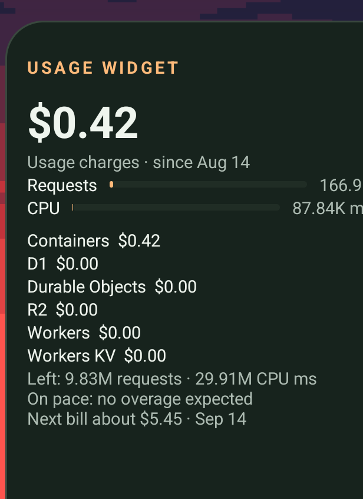
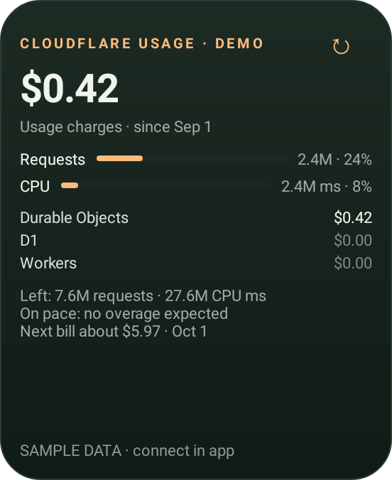
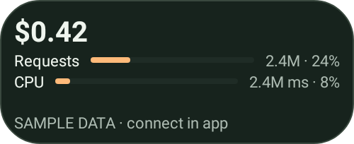
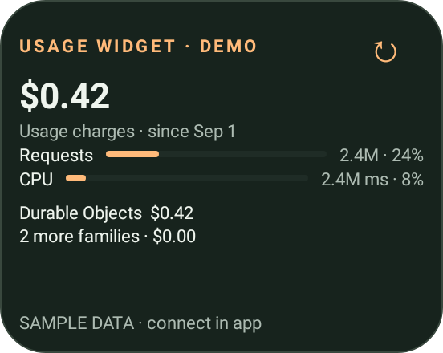
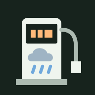

# Usage Widget for Cloudflare

A small, free Android home-screen widget for Cloudflare account usage. Built for a Pixel 7 running GrapheneOS. Android 12 or newer; no Google Play services, hosted backend, advertising, or telemetry.

## Screenshots

<p>


</p>

Left: the widget on a Pixel 7 running GrapheneOS, sized to three rows. Right: the same extra-large card rendered by the test suite with demo data. Smaller sizes, all demo data:

<p>
<br>
<br>
<br>

</p>

 App icon.

## Install

A prebuilt APK is included at `releases/UsageWidget.apk`. It is a personal build signed with the author's own key and has only been tested on a Pixel 7 running GrapheneOS. It may not work on other devices or launchers. Check its SHA-256 against `releases/SHA256SUMS.txt` before installing, or build it yourself from source (see below).

1. Copy `releases/UsageWidget.apk` to the Pixel using USB or your preferred file transfer.
2. Open the APK in Files and allow installation from that source when Android asks.
3. Open **Usage Widget for Cloudflare**. Enable its **Network** permission on GrapheneOS.
4. Choose **Try the demo widget** to preview it, or connect your account below.
5. Tap **Add home-screen widget**. Alternatively, long-press the home screen, choose Widgets, then Usage Widget for Cloudflare.

## Connect your account

Paste your own 32-character account ID, which appears in your Cloudflare dashboard URL. A Wrangler deployment OAuth login does not have Billing Read permission, so a dedicated Billing Read token is required. The deployment credential is not included in the app.

1. In Cloudflare, open **My Profile > API Tokens > Create Token > Create Custom Token**.
2. Give the token **Account > Billing > Read**, restricted to your account.
3. Paste the token into the app and select whether you have Workers Paid.
4. Tap **Save and connect**. The app verifies the API before replacing saved credentials.

Enter the token only in the app. It is encrypted with AES-GCM using an Android Keystore key and excluded from Android backups. Disconnect removes local credentials and the snapshot; revoking the token itself is done in Cloudflare.

What a Billing Read token can read: Cloudflare describes it as read access to the billing profile, subscriptions, invoices and entitlements. The app itself only calls the billable usage and subscriptions endpoints. Anyone who obtained the token could also read the billing profile. On the author's account on 2026-09-12 that profile returned name, billing email, postal address and account type, and no card number, expiry, phone or VAT fields; invoice access was not tested. Cloudflare may return more fields on other accounts. Give the token an expiry date when you create it, revoke it in Cloudflare if the phone is lost, and run `scripts/check-billing-token.ps1` on a PC to see exactly what your own token exposes (it prints field names and whether a card number is masked, never values).

## What it shows

- Current-cycle usage charges, grouped by currency rather than summing different currencies.
- Every returned service in the breakdown, including Workers, Durable Objects, D1, and other metered services.
- Workers Standard request and CPU amounts, identified by raw unit first and by the service name when Cloudflare sends no unit (the live rows are named "Workers Standard Requests (first 10M are included)" and "Workers CPU ms (first 30M are included)" with an empty unit), with static, asset, and cache rows excluded. Rows that Cloudflare groups under the "Workers & Pages" family are still recognized, while sibling products such as Pages Functions are not counted. Unidentified Workers rows are listed as diagnostics in the app, with a "Copy row names" button, never guessed to zero.
- Selected Workers Paid allowances (10M requests and 30M CPU ms/month), with the $5 subscription shown separately. This is a user-selected plan, not an automatically detected subscription.
- API coverage and last successful fetch time. Background refresh approximately every three hours, subject to Android scheduling, plus manual refresh.
- Last successful data stays visible on connection/API errors. Demo data is explicitly labeled.
- The widget resizes from a one-line strip to a full card; the default is a compact one-row size.
- Upcoming charges: a projected current-cycle usage cost, listed account-scope subscription fees with renewal dates, and an estimated next-bill figure that is labeled an estimate and excludes tax, credits, and zone plans (zone plans need zone permissions and are not covered). The manual Workers Paid checkbox drives allowances only, while the subscription line and the estimate come from the /subscriptions API, so the two "$5" mentions do not double-count. The overview total covers all returned cycles, while the upcoming card is scoped to the current cycle.

Widget sizes: the default is a compact 4x1 strip. Long-press the widget to resize it. Sizes range from a one-line strip, to a compact card, to a full card, to a tall card, up to an extra-large card. The tall and extra-large cards add an allowance-left line, a pace line, and a next-bill line; a full-height three-row home-screen cell receives the extra-large card.

Requests and overage: in Workers Paid mode the app shows the request and CPU count, the percent of the 10M request and 30M CPU ms monthly allowance, a pace projection for the cycle, and a USD overage estimate. These estimates are labeled and are suppressed when the data is partial, too early in the cycle, or billed in a currency other than USD.

Usage charges are not the complete invoice: fixed subscriptions, tax, credits, and adjustments may differ. Billing data updates daily; refreshing the widget cannot make Cloudflare publish newer data. The billable usage API is currently alpha and supports self-serve accounts. This app uses the current-cycle endpoint without calendar-month date assumptions.

## Build and checks

This machine has a project-local JDK, Android SDK 35, and Gradle under `.tools/`. Run:

```powershell
powershell -NoProfile -ExecutionPolicy Bypass -File .\scripts\build.ps1
```

The script builds the APK, runs billing tests and Android behavior tests, runs Android lint, then copies the APK to `releases/`. The policy override applies only to that process.

The release passed 101 tests, including Android 12/15 widget/activity tests and native widget rendering at the supported sizes. Android lint reported no errors. The APK signature was verified. The signed release APK is 87732 bytes, SHA-256 `258be5b542fd8b7b0a4e5b80a2bb5de3cf4f48ac29c18672126422b09d02d489` (recorded in `releases/SHA256SUMS.txt`). Live account totals and physical GrapheneOS installation still require the on-device setup above.

For another machine, install JDK 17 and Android SDK 35 with build-tools 35.0.0, set `JAVA_HOME` and `ANDROID_HOME`, then use `gradlew.bat` or `./gradlew`:

```text
gradlew :app:assembleDebug :app:testDebugUnitTest :app:lintDebug
```

To install over USB with debugging enabled and the computer authorized:

```powershell
powershell -NoProfile -ExecutionPolicy Bypass -File .\scripts\build.ps1 -Install
```

The installable APK is a signed release build, with debugging disabled. The Windows build script creates and reuses a personal signing key in `private/`. Preserve that folder for seamless updates; an APK signed with a different key requires uninstalling the old app. No account secrets are embedded in the APK. The portable Gradle command above builds a separate debug-signed development APK.

## Source map

- `Billing.java`: API parsing, decimal costs, metric aggregation and display formatting.
- `Repository.java`: fixed-origin HTTPS billing fetch, validation and cached snapshot updates.
- `Store.java`: local preferences and Keystore-backed encryption.
- `UsageWidget.java`, `res/layout/widget.xml`: home-screen widget.
- `MainActivity.java`: connection, demo, usage details and widget pinning.
- `RefreshJob.java`, `BootReceiver.java`: Android background scheduling.
- `app/src/test/`: billing regressions and Android widget/activity tests.
- `PLAN.md`: implementation and handoff status.

## References

- [Billable Usage API](https://developers.cloudflare.com/api/resources/billing/subresources/usage/methods/get_account_usage_v1/)
- [Cloudflare billing data and refresh cadence](https://blog.cloudflare.com/billable-usage-api/)
- [Workers pricing](https://developers.cloudflare.com/workers/platform/pricing/)
- [Android widgets](https://developer.android.com/develop/ui/views/appwidgets)
- [Android Keystore](https://developer.android.com/privacy-and-security/keystore)

## Contributing

Issues and pull requests are welcome. Run `scripts/build.ps1` (or the portable Gradle command above) before opening a pull request; it builds the APK and runs the billing tests, the Android behavior tests and lint. Keep the rules in `AGENTS.md`: never sum cumulative costs, never turn missing usage into zero, keep currencies separate, and never present demo data as live.

## License

MIT. See [LICENSE](LICENSE).

## Trademarks

Cloudflare and Cloudflare Workers are trademarks and/or registered trademarks of Cloudflare, Inc. in the United States and other jurisdictions. This project is an independent tool and is not affiliated with, endorsed by, or sponsored by Cloudflare, Inc.

Independent personal tool, not affiliated with Cloudflare.

🌱
